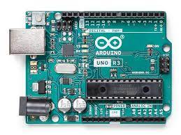
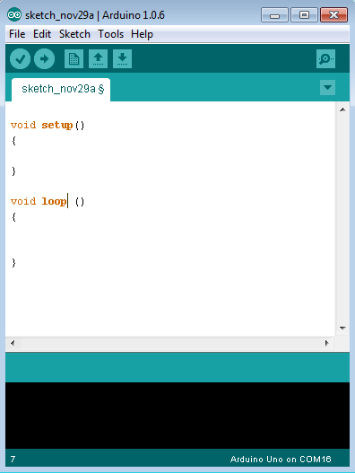
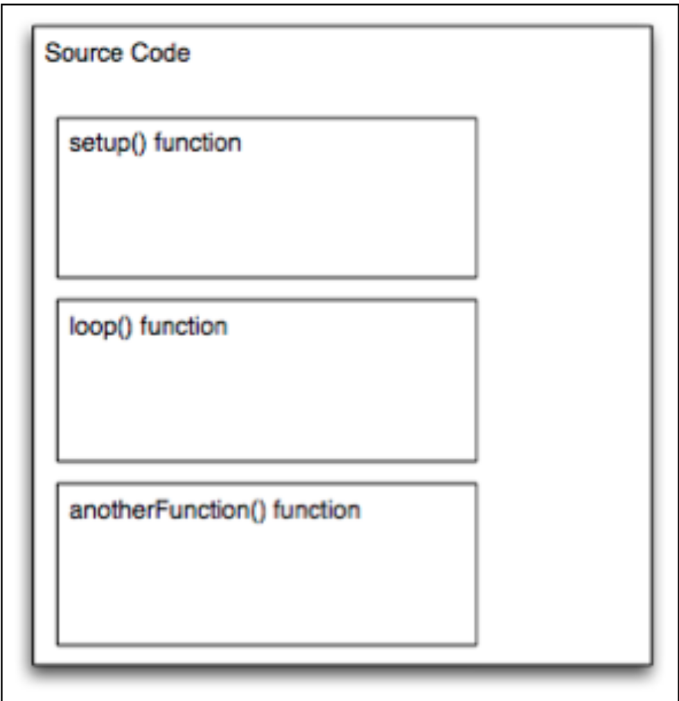

# **Satrio Notes - Arduino**

## **Intro**



**What is a microcontroller?**

    A microcontroller is an integrated circuit (IC) containing all main parts of a typical
    computer, which are as follows:

    - Processor -> the part where all decisions are taken and which can calculate
    - Memories
    - Peripherals
    - Inputs and outputs

**What is a Arduino?**

    Arduino is an open source physical computing platform based on a simple input/output (I/O) board and a development environment that implements the Processing language.

**What is Sensor and Actuator?**

    Actuator is the mechanism by which a control system acts upon an environment.

    The sensors are defined as a machine, module, or a device that detect changes in the environment.

## **Software IDE**

    Arduino IDE is The IDE (Integrated Development Environment) is a special program running on your computer that allows you to write sketches for the Arduino board in a simple language modeled after the Processing

## **Starter**

### **Program Structure**

    Arduino programs can be divided in three main parts: Structure, Values (variables and constants), and Functions.

    Sketch − The first new terminology is the Arduino program called “sketch”.



Software structure consist of two main functions

    - Setup( ) function is called when a sketch starts. Use it to initialize the variables, pin modes, start using libraries, etc. The setup function will only run once, after each power up or reset of the Arduino board.
    - Loop( ) function does precisely what its name suggests, and loops consecutively, allowing your program to change and respond. Use it to actively control the Arduino board.

### **The scope concept**

    Inside a function or a block, which is called local variables.
    In the definition of function parameters, which is called formal parameters.
    Outside of all functions, which is called global variables.



```c
// this variable is declared at the highest level, making it visible everywhere
int globalString;
void setup(){
// some code
}
void loop(){
int a; // a is visible inside the loop function only
anotherFunction(); // calling the global function anotherFunction
// … some other code
}
void anotherFunction() {
// … yet another code
int veryLocalVar; // veryLocalVar is visible only in anotherFunction
function
```

**Basic Code**

```c
// Blinking LED
const int LED = 10; // LED connected to
                    // digital pin 10
void setup()
{
  pinMode(LED, OUTPUT);    // sets the digital
                           // pin as output
}
void loop()
{
  digitalWrite(LED, HIGH);   // turns the LED on
  delay(1000);               // waits for a second
  digitalWrite(LED, LOW);    // turns the LED off
  delay(1000);               // waits for a second
}
```

## **Special Symbol**

    Arduino includes a number of symbols to delineate lines of code, comments, and blocks of code.

    ; (semicolon)
    Every instruction (line of code) is terminated by a semicolon. This syntax lets you format the code freely. You could even put two instructions on the same line, as long as you separate them with a semicolon. (However, 
    this would make the code harder to read.)
    Example:
    delay(100);

    {} (curly braces) 
    This is used to mark blocks of code. For example, when you write code for the loop() function, you have to use  curly braces before and after the code.
    Example:
    void loop() {
    Serial.println("ciao");
    }

    comments
    These are portions of text ignored by the Arduino processor, but are ex-
    tremely useful to remind yourself (or others) of what a piece of code does.
    There are two styles of comments in Arduino:
    // single-line: this text is ignored until the end of the line
    /* multiple-line:
    you can write
    a whole poem in here
    */

### **Constant**

    Arduino includes a set of predefined keywords with special values.HIGH and LOW are used, for example, when you want to turn on or off an Arduino pin. INPUT and OUTPUT are used to set a specific pin to be either and input or an output


### **Variables**

    Variables are named areas of the Arduino’s memory where you can store data that you can use and manipulate in your sketch. As the name suggests, they can be changed as many times as you like.

1. **boolean** Can have one of two values: true or false.

2. **char** Holds a single character, such as A. Like any computer, Arduino stores it as a number, even though you see text. When chars are used to store numbers, they can hold values from –128 to 127

3. **byte**
Holds a number between 0 and 255. As with chars, bytes use only one byte of memory.

4. **int**
Uses 2 bytes of memory to represent a number between –32,768 and 32,767; it’s the most common data type used in Arduino.

5. **unsigned int**
Like int, uses 2 bytes but the unsigned prefix means that it can’t store negative numbers, so its range goes from 0 to 65,535.

6. **long**
This is twice the size of an int and holds numbers from –2,147,483,648 to 2,147,483,647.
unsigned long
Unsigned version of long; it goes from 0 to 4,294,967,295.

7. **float**
This quite big and can hold floating-point values, a fancy way of saying that you can use it to store numbers with a decimal point in it. It will eat up 4 bytes of your precious RAM and the functions that can handle them use up a lot of code memory as well. So use floats sparingly. 

8. **double**
Double-precision floating-point number, with a maximum value of 1.7976931348623157 x 10308. Wow, that’s huge!

9. **string**
A set of ASCII characters that are used to store textual information (you might use a string to send a message via a serial port, or to display on an LCD display).

10. **array**
A list of variables that can be accessed via an index. They are used to build tables of values that can easily be ccessed. For example, if you want to store different levels of brightness to be used when fading an LED, you could create six variables called light01, light02, and so on. Better yet,  you could use a simple array like:
int light[6] = {0, 20, 50, 75, 100};

### **Control Structure**

Arduino includes keywords for controlling the logical flow of your sketch.

- **if-else**
This structure makes decisions in your program. if must be followed by a question specified as an expression contained in parentheses. If the expression is true, whatever follows will be executed. If it’s false, the block of code following else will be executed. It’s possible to use just if without providing an else clause.

    ```c
    if (val == 1) {
    digitalWrite(LED,HIGH);
    }
    ```

- **for**
Lets you repeat a block of code a specified number of times.

    ```c
    for (int i = 0; i < 10; i++) {
        Serial.print("ciao");
    }
    ```

- **switch case**
The if statement is like a fork in the road for your program. switch case is like a massive roundabout. It lets your program take a variety of directions depending on the value of a variable. It’s quite useful to keep your code tidy as it replaces long lists of if statements.

    ```c
    switch (sensorValue) {
        case 23:
        digitalWrite(13,HIGH);
        break;
        case 46:
        digitalWrite(12,HIGH);
        break;
        default: // if nothing matches this is executed
        digitalWrite(12,LOW);
        digitalWrite(13,LOW);
    }
    ```

- **while**
Similar to if, this executes a block of code while a certain condition is true.

    ```c
    // blink LED while sensor is below 512
    sensorValue = analogRead(1);
    while (sensorValue < 512) {
    digitalWrite(13,HIGH);
    delay(100);
    digitalWrite(13,HIGH);
    delay(100);
    sensorValue = analogRead(1);
    }
    ```

- **do - while**
Just like while, except that the code is run just before the the condition is evaluated. This structure is used when you want the code inside your block to run at least once before you check the condition.

    ```c
    do  {
    digitalWrite(13,HIGH);
    delay(100);
    digitalWrite(13,HIGH);
    delay(100);
    sensorValue = analogRead(1);
    } while (sensorValue < 512);
    ```

- **break**
This term lets you leave a loop and continue the execution of the code that appears after the loop. It’s also used to separate the different sections of a switch case statement.

    ```
    // blink LED while sensor is below 512
    do  {
    // Leaves the loop if a button is pressed
    if (digitalRead(7) == HIGH)
        break;
    digitalWrite(13,HIGH);
    delay(100);
    digitalWrite(13,LOW);
    delay(100);
    sensorValue = analogRead(1);
    } while (sensorValue < 512);
    ```

- **continue**
When used inside a loop, continue lets you skip the rest of the code inside it and force the condition to be tested again.

    ```c
    for (light = 0; light < 255; light++)
    {
    // skip intensities between 140 and 200
    if ((x > 140) && (x < 200)) 
        continue;
    analogWrite(PWMpin, light);
    delay(10);
    }
    ```

- **return**
Stops running a function and returns from it. You can also use this to return a value from inside a function.
For example, if you have a function called computeTemperature() and you want to return the result to the part of your code that invoked the function you would write something like:

    ```c
    int computeTemperature() {
        int temperature = 0;
        temperature = (analogRead(0) + 45) / 100;
        return temperature;
    }
    ```

### **Aritmatic and Formulas**

You can use Arduino to make complex calculations using a special syntax. + and – work like you’ve learned in school, and multiplication is represented with an * and division with a /. There is an additional operator called “modulo” (%), which returns the remainder of an integer division.

```c
a =  2 + 2; 
light = ((12 * sensorValue) - 5 ) / 2;
remainder = 3 % 2; // returns 1
```

### **Comparison Operators**

When you specify conditions or tests for if, while, and for statements, these are the operators you can use:
- ( == )  equal to
- ( != )  not equal to
- ( < )  less than
- ( > )  greater than
- ( <= )  less than or equal to
- ( >= )  greater than or equal to

### **Boolean Operators**
These are used when you want to combine multiple conditions. For example, if you want to check whether the value coming from a sensor is between 5 and 10, you would write:

```c
if ((sensor => 5) && (sensor <=10))
```

There are three operators: and, represented with &&; or, represented with ||; and finally not, represented with !.

### **Compound Operators**

These are special operators used to make code more concise for some very common operations like incrementing a value.

- **increment and decrement (–– and ++)**

    These increment or decrement a value by 1. Be careful: if you write i++ this increments i by 1 and evaluates to the equivalent of i+1; ++i evaluates to the value of i and then increments i. The same applies to ––.

- **(+= , –=, *= and /=)***

    These make it shorter to write certain expressions. The following two expressions are equivalent:

    ```
    a = a + 5;
    a += 5;
    ```

### **Input and Output Function**

Arduino includes functions for handling input and output. You’ve already seen some of these in the example programs throughout the book.

- **pinMode(pin, mode)**
    
    Reconfigures a digital pin to behave either as an input or an output.
    ```c
    pinMode(7,INPUT); // turns pin 7 into an input
    ```

- **digitalWrite(pin, value)**

    Turns a digital pin either on or off. Pins must be explicitly made into an output using pinMode before digitalWrite will have any effect.
    ```c
    digitalWrite(8,HIGH); // turns on digital pin 8
    ```

- **int digitalRead(pin)**

    Reads the state of an input pin, returns HIGH if the pin senses some voltage or LOW if there is no voltage applied.
    ```
    val = digitalRead(7); // reads pin 7 into val
    ```

- **int analogRead(pin)**

    Reads the voltage applied to an analog input pin and returns a number between 0 and 1023 that represents the voltages between 0 and 5 V.
    ```
    val = analogRead(0); // reads analog input 0 into val
    ```

- **analogWrite(pin, value)**

    Changes the PWM rate on one of the pins marked PWM. pin may be 11,10,9, 6, 5, 3. value may be a number between 0 and 255 that represents the scale between 0 and 5 V output voltage.
    ```c
    analogWrite(9,128); // Dim an LED on pin 9 to 50%
    ```

- **shiftOut(dataPin, clockPin, bitOrder, value)**

    Sends data to a shift register, devices that are used to expand the number of digital outputs. This protocol uses one pin for data and one for clock. bitOrder indicates the ordering of bytes (least significant or most significant) and value is the actual byte to be sent out.

    ```c
    shiftOut(dataPin, clockPin, LSBFIRST, 255);  
    ```
- **unsigned long pulseIn(pin, value)**

    Measures the duration of a pulse coming in on one of the digital inputs.This is useful, for example, to read some infrared sensors or accelerometers that output their value as pulses of changing duration.
    ```c
    time = pulsein(7,HIGH); // measures the time the next
                            // pulse stays high
    ```

<br />

## **Book Reference**

- C Programming for Arduino [Here you can buy](https://www.amazon.com/C-Programming-Arduino-Julien-Bayle/dp/1849517584).
- Getting Started with Arduino [Here you can buy](https://www.amazon.com/Getting-Started-Arduino-Electronics-Prototyping/dp/1449363334/).